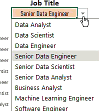
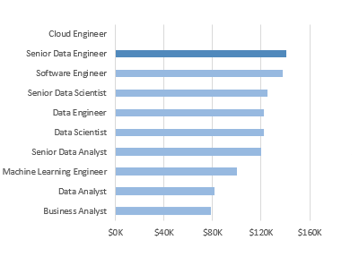
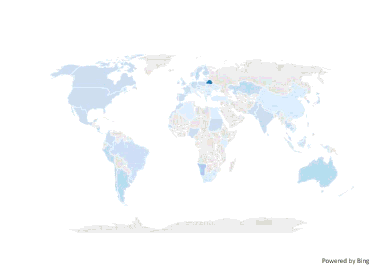

# 📊 Salary Insights Dashboard (Excel Project)


  

## 📌 Project Overview

In this project, I built an **interactive Salary Insights Dashboard** using Microsoft Excel.  

I worked with over **30,000 job postings** to analyze salary trends across different job titles, countries, and employment types. My goal was to turn raw job market data into a structured, user-friendly dashboard that helps answer practical career-related questions.

The dashboard updates dynamically based on user selections, making it fully interactive without using any external tools.

---

## 📂 Dataset

- **Source:** Job postings dataset from Kaggle compiled by Luke Barosse
- **Size:** ~32,673 rows  
- **Format:** Excel  

### Key Columns Used

- `Job Title Short`
- `Job Country`
- `Job Type` (Full-time, Part-time, Internship, Contract)
- `Salary Year Avergae`
- `Job Schedule Type`
- `Job Via`
- Other supporting fields (Company, Skills, etc.)

Although the dataset contained many columns, I focused specifically on the fields necessary to answer salary and demand-related questions.

---

## 🎯 Objectives

When building this dashboard, I aimed to answer:

1. What is the **median salary** for a selected job title?
2. How does salary vary by **country**?
3. How does salary differ by **employment type**?
4. Which **platform posts the most jobs** for a selected role?
5. How many job postings exist for that role?
6. Which countries show the highest demand?

I wanted the dashboard to simulate a real-world decision-support tool for someone exploring career options in data-related fields.

---

## 🛠 Tools & Techniques Used

I completed this project entirely in:

- Microsoft Excel  
- Excel Tables  
- Data Validation  
- Excel Formulas  
- Column Charts  
- Map Chart  

I did not use Power BI or any programming language. Everything was done using Excel features.

---

## 🔄 Data Preparation & Calculations

### Structuring the Data

- I converted the dataset into an **Excel Table** for structured referencing.
- I organized the data to make it easier to filter and aggregate.
- I created calculated metrics directly using Excel formulas.

### Metrics I Built

- **Median Salary** (based on selected filters)
- **Total Job Count**
- **Top Job Platform**

Instead of using slicers, I used **Data Validation dropdowns** to allow users to select:  


- Job Title  
- Country  
- Job Type  

The dashboard updates automatically based on those selections.

---

## 📊 Dashboard Components

### 1️⃣ KPI Section


Displays:

- Median Salary  
- Total Job Count  
- Top Job Platform  

All KPIs change dynamically based on user inputs.

---

### 2️⃣ Salary Comparison Chart


- Column chart showing median salary across job titles.
- Updates depending on selected country and job type.
- Allows comparison of roles within the same region.

---

### 3️⃣ Map Visualization

  
- Shows job distribution by country.
- Darker color indicates higher job concentration.
- Updates based on selected job title.

---

### 4️⃣ Job Type Chart

- Displays the job Type by salary.
- Helps identify which types are in high demand.

---

## 🧠 What I Learned

This project strengthened my understanding of:

- Working with large datasets in Excel
- Structuring raw data into analyzable formats
- Using Excel Tables effectively
- Writing dynamic formulas for conditional aggregation
- Working with Formulas
- Designing dashboards for clarity and usability
- Building interactivity without advanced tools

One key lesson I learned is that dashboard design is not just about calculations — it is about making information easy to understand and actionable.

I also learned how important it is to think through logic before building formulas. Planning the structure first made the dashboard more scalable and easier to manage.

---

## 📁 Project Structure

```

Salary-Dashboard/
│
├── images
├── Salary_Dashboard.xlsx
└── README.md

```

---

## ▶️ How to Use

1. Open `Salary_Dashboard.xlsx`
2. Use the dropdown menus to select:
   - Job Title  
   - Country  
   - Job Type  
3. View automatically updated KPIs and charts.

No installation or additional tools are required.

---

## 🚀 Skills Demonstrated

- Data cleaning in Excel  
- Structured referencing  
- Conditional calculations  
- Median aggregation logic  
- Dashboard layout design  
- Interactive reporting  
- Data visualization  

---

## 📌 Conclusion

This was my first complete Excel dashboard project.  

Through this project, I moved from simply analyzing data to designing an interactive tool that delivers insights. It represents an important step in my journey toward becoming a data professional.


